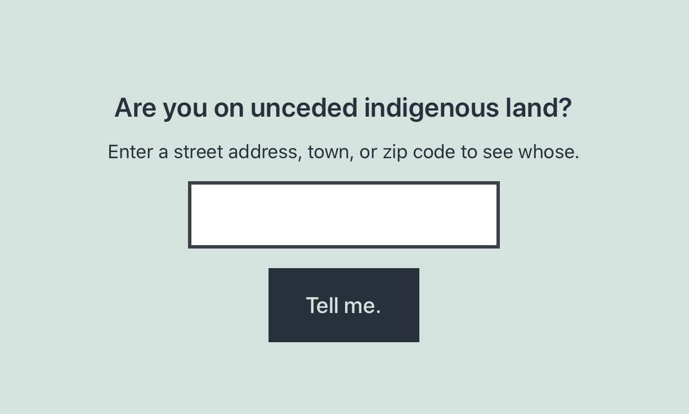
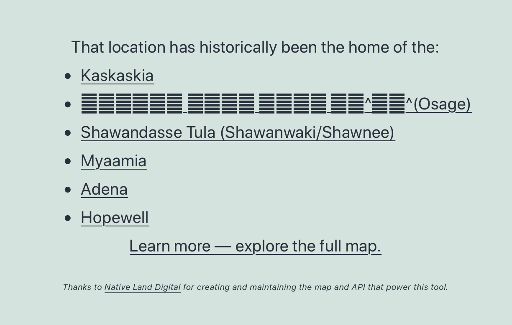

# Native Lands Search

Stable tag: 1.1.3  
Requires at least: 5.7  
Tested up to: 5.8  
Requires PHP: 7.4  
License: GPL v2 or later  
Tags: block  
Contributors: alexjgustafson  

## Description

Creates a block allowing your readers to search for a location and see a list of native territories that historically contained it.

Creates a block pattern that includes the Native Lands Search block in a two-column layout.

Made with love for the folks at [Pipewrench Magazine](https://pipewrenchmag.com).

Powered by the [native-land.ca API](https://native-land.ca/resources/api-docs/) and [Google Geocoding API](https://developers.google.com/maps/documentation/geocoding/overview).

### Requirements
* PHP 7.4+
* WordPress 5.7+
* Google Geocoding API Key

### Usage

1. Install and activate the plugin
2. [Create a Google Geocoding API Key](https://developers.google.com/maps/documentation/geocoding/get-api-key)
3. Navigate to Settings > Native Lands and save the API key in the provided setting.
4. In any post, add the "Native Lands Search" block or "Native Lands Aside" block pattern to the post content.
5. Edit the copy within the Native Lands Search block as desired.

## Screenshots
1. The block by default 
2. The block with a successful result 